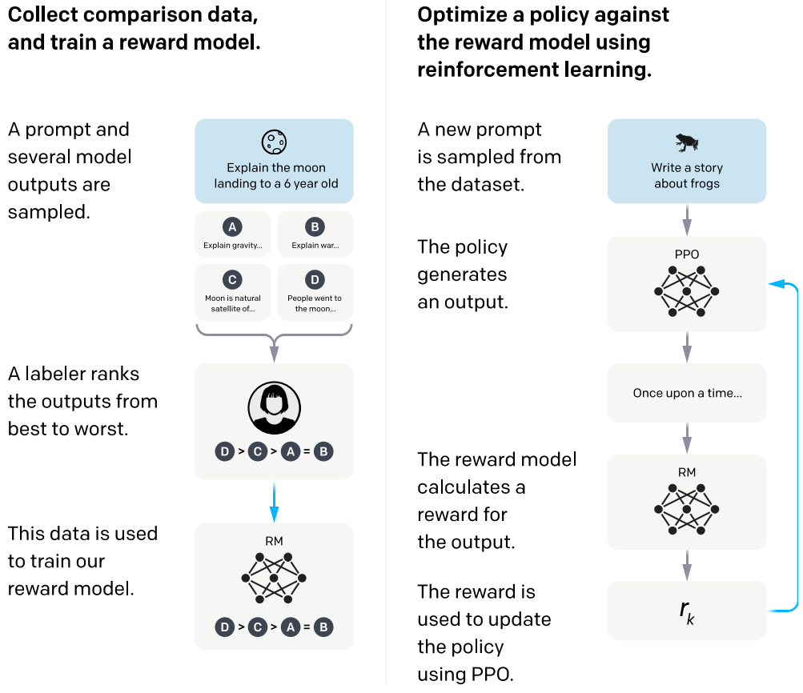

# ChatGLM-6B-RLHF
本仓库介绍了针对ChatGLM-6B的RLHF (Reinforcement Learning with Human Feedback)训练流程，该实现主要基于https://github.com/hiyouga/ChatGLM-Efficient-Tuning与https://github.com/lvwerra/trl。

相关论文：

- PPO算法介绍：[Proximal Policy Optimization Algorithms](https://arxiv.org/abs/1707.06347)
- ChatGPT对PPO算法的应用：[Training language models to follow instructions with human feedback](https://arxiv.org/abs/2203.02155)

## RLHF简介

RLHF旨在将模型输出与人类偏好进行对齐，该方法主要分为两步：

- 训练Reward Model，模仿人类偏好对生成结果打分：收集一批prompt数据，然后针对每个prompt从Policy Model（ChatGLM）中采样若干个生成结果，对这些生成结果进行人工排序，使用排序结果训练Reward Model，使其预测的生成结果得分与人类偏好一致。
- 以人类偏好分数作为监督信号，使用PPO强化学习算法优化Policy Model：在训练过程中维护两个模型，分别称为Policy Model和Reference Model。对于训练集中的每个prompt，从Policy Model中采样一个生成结果，由Reward Model预测该生成结果的人类偏好得分，使用该得分通过PPO算法训练Policy Model。在训练过程中，为了避免Policy Model与初始模型（ChatGLM）偏离较远，计算Policy Model与Reference Model（固定为初始模型ChatGLM）在词表上概率分布的KL散度，并将其作为损失函数的一部分。

方法流程如下图所示（图片截取自[Training language models to follow instructions with human feedback](https://arxiv.org/abs/2203.02155)）：

{:height="50%" width="50%"}

## 软件依赖

除 ChatGLM-6B 的依赖之外，还要求torch的版本不低于1.13.1，transformers的版本不低于4.27.4：

```bash
pip install -r requirements.txt
```
该仓库基于Python 3.9完成了测试。

## 使用方法

### 训练Reward Model

使用以下指令训练Reward Model：
```shell
bash scripts/train_reward_model.sh
```
其中，有三个主要的参数需要设置：

```bash
python src/train_rm.py \
    --model_name_or_path THUDM/chatglm-6b \ # 模型名字或模型的本地路径
    --do_train \
    --dataset comparison_gpt4_zh \ # 数据集名字，对应于data/comparison_gpt4_data_zh.json
    --finetuning_type lora \
    --output_dir path_to_rm_checkpoint \ # 模型存储路径，用于存放训练过程中的checkpoints
    --per_device_train_batch_size 4 \
    --gradient_accumulation_steps 4 \
    --lr_scheduler_type cosine \
    --logging_steps 10 \
    --save_steps 1000 \
    --learning_rate 1e-5 \
    --num_train_epochs 1.0 \
    --fp16
```

为了节省人工标注的时间开销，可以使用GPT-4判断模型生成结果的质量，并将GPT-4的标注结果作为Reward Model的训练数据。训练数据样例如下，开发者可按照该格式构造自己的训练样本：

```json
{
  "instruction": "下面是描述任务的指令，与提供进一步上下文的输入配对。编写适当地完成请求的响应。\n\n＃＃＃ 操作说明：\n解释为什么下面的分数等于 1/4\n\n＃＃＃ 输入：\n4/16",
  "input": "",
  "output": [ // 根据人工或者GPT-4的标注结果，第一个output优于第二个output，按照该顺序排列生成结果
    "分数 4/16 等于 1/4，因为分子和分母都可以被 4 整除。将顶部和底部数字都除以 4 得到分数 1/4。",
    "1/4 与 1/4 相同。"
  ]
}
```

### 训练Policy Model

使用以下指令训练Reward Model：

```shell
bash scripts/train_policy_model.sh
```

其中，有五个主要的参数需要设置：

```bash
python src/train_ppo.py \
    --model_name_or_path THUDM/chatglm-6b \ # 模型名字或模型的本地路径
    --do_train \
    --dataset alpaca_gpt4_zh \ # 数据集名字，对应于data/alpaca_gpt4_data_zh.json
    --finetuning_type lora \
    --checkpoint_dir path_to_sft_checkpoint \ # 通过SFT训练得到的Policy Model的路径
    --reward_model path_to_rm_checkpoint \ # 训练得到的Reward Model的路径
    --output_dir path_to_ppo_checkpoint \ # 模型存储路径，用于存放训练过程中的checkpoints
    --per_device_train_batch_size 2 \
    --gradient_accumulation_steps 4 \
    --lr_scheduler_type cosine \
    --logging_steps 10 \
    --save_steps 1000 \
    --learning_rate 1e-5 \
    --num_train_epochs 1.0 \
    --fp16
```

训练数据样例如下，开发者可按照该格式构造自己的训练样本。其中，output是Reference Model预先生成的结果，用于计算Policy Model与Reference Model在每个输出位置上概率分布的KL散度。

```json
{
  "instruction": "保持健康的三个提示。",
  "input": "",
  "output": "以下是保持健康的三个提示：\n\n1. 保持身体活动。每天做适当的身体运动，如散步、跑步或游泳，能促进心血管健康，增强肌肉力量，并有助于减少体重。\n\n2. 均衡饮食。每天食>用新鲜的蔬菜、水果、全谷物和脂肪含量低的蛋白质食物，避免高糖、高脂肪和加工食品，以保持健康的饮食习惯。\n\n3. 睡眠充足。睡眠对人体健康至关重要，成年人每天应保证 7-8 小时的睡眠。良好的睡眠有助于减轻压力，促进身体恢复，并提高注意力和记忆力。"
}
```

## 样例分析

